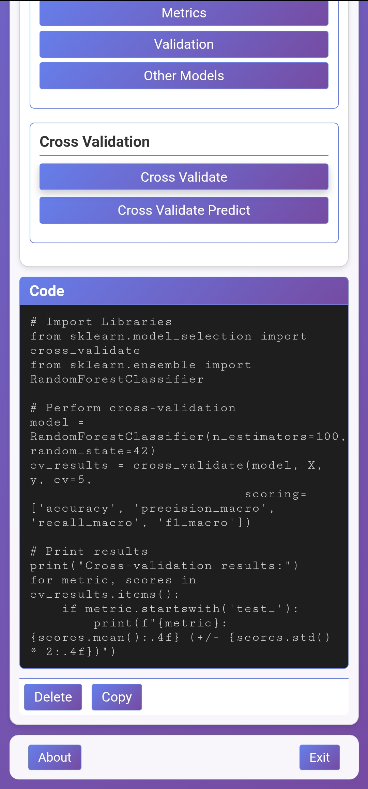
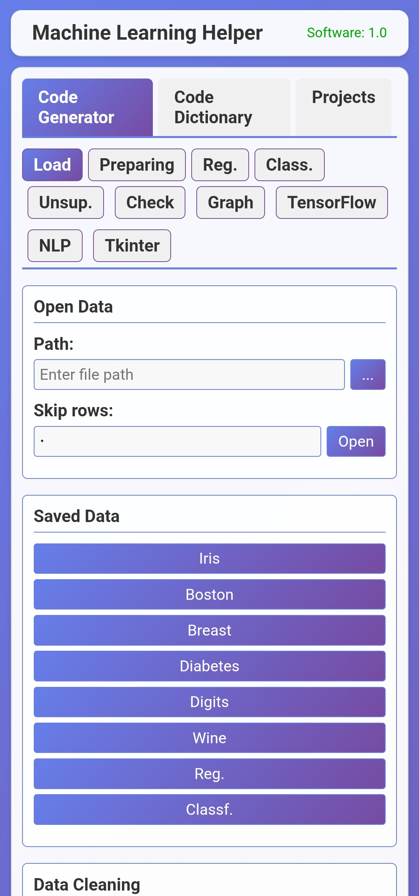
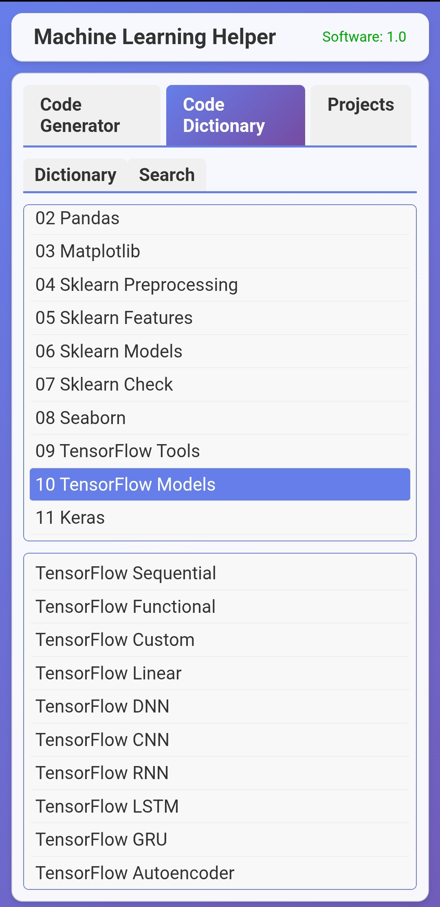
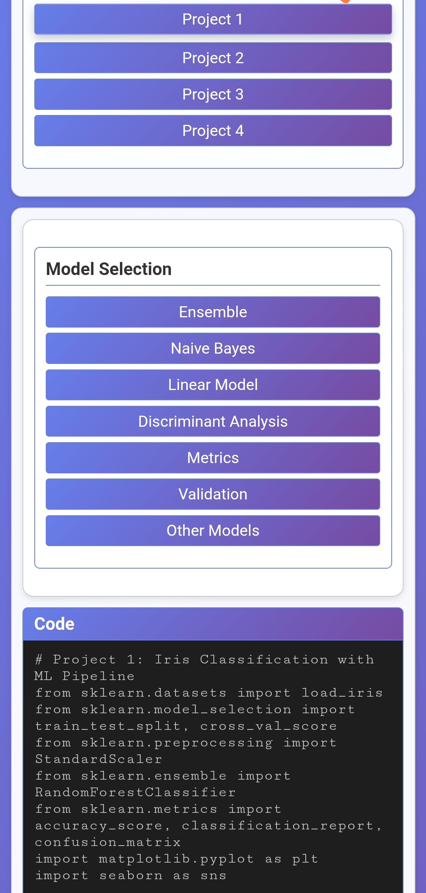

ML-Helper

Machine Learning Helper (Web and mobile Edition )

هو تطبيق ويب وله [نسخة موبايل ](https://www.mediafire.com/file/1x2zizj5uht3efz/app3764191-dtislj.apk/file) تفاعلي يُولّد لك أكواد Python جاهزة لمهام تعلّم الآلة والذكاء الاصطناعي، من تحميل البيانات وتحضيرها، إلى بناء النماذج (Classification, Regression, Clustering)، وتقييم الأداء، أو بناء نماذج عميقة باستخدام 

TensorFlow

تم تطوير هذا المشروع كنسخة ويب حديثة ومستوحاة من الأداة الرائعة  [ MLHelper](https://github.com/HeshamAsem/MLHelper) من تطوير Hesham Asem، مع تحسينات في التصميم، التنظيم، وتجربة المستخدم و بملف واحد شامل الواجهة والمنطق للتسهيل

الميزات

توليد أكواد Python ، دعم كامل لمكتبات التعلّم الآلي الشهيرة:

scikit-learn TensorFlow / Keras pandas, numpy, matplotlib, seaborn أقسام مُنظمة حسب المهام:

تحميل البيانات (من ملفات أو مجموعا.ت جاهزة مثل Iris, Wine, Digits...) تنظيف البيانات وتحضيرها (Scaling, Encoding, Imputation...) 📊 بناء نماذج تعلّم آلي (Classification, Regression, Unsupervised) 📈 تقييم النماذج (Accuracy, F1, Confusion Matrix...) رسم المخططات البيانية 🧠 نماذج TensorFlow (DNN, CNN, RNN) 💬 معالجة اللغة الطبيعية (NLP) 🖥️ تصميم واجهات رسومية بـ Tkinter قاموس أكواد شامل يحتوي على مئات الأمثلة الجاهزة حسب المكتبة والوظيفة. واجهة مستخدم أنيقة وسريعة تعمل مباشرة في المتصفح بدون الحاجة لتثبيت أي شيء.

<table>
  <tr>
    <td style="padding-right:50px"></td>
    <td style="padding-right:50px"></td>
    <td style="padding-right:50px"></td>
    <td></td>
  </tr>
</table>

كيفية الاستخدام

افتح الملف index.html مباشرة في متصفحك (لا حاجة لخادم). اختر القسم الذي تحتاجه من الشريط الجانبي (مثل: TensorFlow، Tkinter، Classification...). انقر على الزر المناسب لتوليد الكود. انسخ الكود واستخدمه في مشروعك

لتحميل نسخة تطبيق الموبايل [إضغط هنا](https://www.mediafire.com/file/1x2zizj5uht3efz/app3764191-dtislj.apk/file) 

بُني بحب لتسهيل رحلتك في عالم تعلم الآلة.
